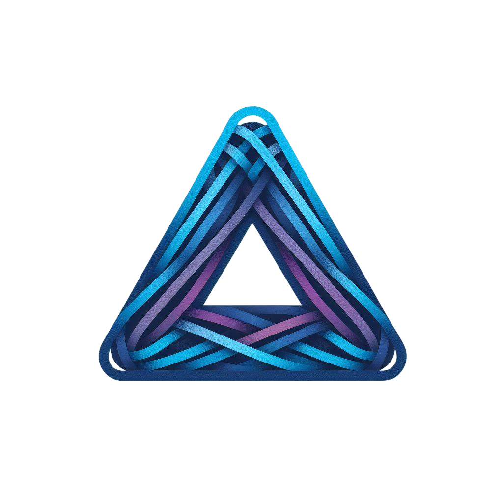

  

<h3 align="center">Accomplished Founder with a strong background in AI Implantation and Data Science.</h3>

- 🌱 I’m currently exploring cutting-edge AI technologies and their applications.
- ⚡ Fun fact: I believe that technology and innovation are the keys to solving complex challenges.

## Languages

## Frameworks 

## Databases

 

## AI and Machine Learning

 

## Data Engineering

 

## NLP & Transformers

 

## Visualization & BI

 

## About Me

Pioneered the implementation of Apache Airflow and Kubeflow, orchestrating 50+ machine learning workflows and slashing model deployment times by 60%, resulting in faster iteration and improved business outcome. Skilled in strategic project management and team leadership. Seeking a challenging executive role to leverage technical expertise and drive engineering excellence.

# Professional Experience

---

### 🔹 Algorithm Architect & Lead Data Scientist  
**Live Sports AI Director Platform | Contractor via Braintrust**

- Ingested multi-camera live video feeds using Kafka and developed PyTorch-based player tracking models for real-time sports coverage.  
- Designed LSTM-based predictive pipelines in TensorFlow to detect key plays and dynamically switch between 3 camera angles.  
- Increased viewer engagement and reduced manual switching load for production teams by automating high-action scene selection.  
- Containerized inference services using Docker, deployed and scaled with Kubernetes, and tracked experiments using Weights & Biases.

---

### 🔹 Tech Lead – Real-Time Multilingual Translator  
**Speech-to-Speech Translation Platform | Contractor via Braintrust**

- Led a team of 10 engineers to fine-tune Kokoro transformer models for low-latency speech translation on edge devices (SBCs).  
- Deployed models as LangChain-based microservices, achieving <200ms latency across 6 supported languages in real-time environments.  
- Automated data ingestion and translation workflows using Apache Airflow, improving fault tolerance and processing scalability by 40%.  
- Empowered customer service teams to deliver localized responses instantly in global support centers.

---

### 🔹 Senior Data Scientist – Insurance Risk Analytics  
**AI-Based Risk Analysis Platform | Contractor via Braintrust**

- Led end-to-end development of an intelligent underwriting platform to assess customer-level risk for dynamic insurance pricing.  
- Engineered risk features from historical claims and geo-demographic data; trained and deployed XGBoost and scikit-learn models for real-time scoring.  
- Automated ETL pipelines with Apache Airflow and Spark; implemented Snowflake data quality monitoring for compliance and accuracy.  
- Built interactive Power BI dashboards for underwriters to tailor policies and premiums, accelerating quote generation by 30% and improving customer satisfaction.

---

### 🔹 Senior Data Scientist – Insurance Risk Analytics  
**AI-Based Risk Analysis Platform | Contractor via Braintrust**

- Led development of an end-to-end risk analysis platform to help underwriters assess individual insurance applicants with greater precision.  
- Engineered advanced features from historical claims and geo-demographic data; trained and deployed XGBoost and scikit-learn models to score applicant risk in real time.  
- Automated data ingestion and transformation workflows using Apache Airflow and Spark; implemented quality monitoring in Snowflake to ensure data integrity.  
- Delivered interactive Power BI dashboards that allowed underwriters to visualize risk profiles and tailor personalized insurance policies.  
- Enabled the business to dynamically price premiums based on customer-level risk, improving customer satisfaction and accelerating underwriting cycles by 30%.

---
### 🔹 Data Scientist – Real Estate Valuation AI  
**Intelligent Property Pricing Engine | Contractor via Braintrust**

- Scraped real estate news sentiment using Hugging Face Transformers and merged with property-level market data in Spark pipelines.  
- Built an MLflow-tracked LightGBM ensemble model that improved property valuation accuracy by 10% compared to internal benchmarks.  
- Enabled property investors and agents to make more informed pricing decisions using a data-driven valuation platform.  
- Delivered scalable model pipelines that processed thousands of listings daily for urban and suburban markets.

---
### 🔹 Data Analyst – Autonomous Object Detection  
**Computer Vision for Self-Driving Vehicles | Contractor via Braintrust**

- Trained YOLO and TensorFlow models on multi-class road-scene data for accurate object detection on edge hardware.  
- Optimized inference using TensorRT for deployment on real-time AV systems, reducing latency by 35%.  
- Managed end-to-end MLOps workflows in Kubeflow and CI/CD in GitLab, maintaining 99% service uptime.  
- Contributed to a safer AV pipeline by improving detection accuracy in varied lighting and weather conditions.

---
### 🔹 Founder & Lead Architect  
**LEAP – AI Systems Architecture & R&D | 2013 – 2024**

- Founded and led LEAP, an AI R&D company focused on architecting scalable, cost-efficient systems for adaptive intelligence applications.  
- Designed and deployed infrastructure solutions that reduced operational overhead by 25% through automation, modular architecture, and system efficiency tuning.  
- Invented and architected **Ozone (O³)** – a dynamic-network AI system that assembles custom sub-networks per input, reducing training data requirements by 40% and inference latency by 30%.  
- Pioneered neuromorphic-inspired adaptive intelligence design, integrating principles of modularity, context-awareness, and resource-efficient inference.  
- Authored and published the research paper: **“Ozone (O³): A Dynamic Neuromorphic Intelligence Architecture for Adaptive Intelligences”**, presenting breakthroughs in real-time, input-adaptive computation frameworks.

## Education:
<ul>
  <li>Bachelor of Engineering in Computer Software Engineering, University of Bedfordshire (2018)</li>
  <li>Minds and Machines Summer Course, MIT Brains (Jun 2018 - Sep 2018)</li>
  <li>Computational Cognitive Science, MIT (2018 - 2019)</li>
</ul>

## Key Projects and Achievements:
## Projects

---

### [Milk Quality Prediction](https://github.com/TheFoxDecoder/Milk-Quality-Prediction.git)  
**Milk Quality Prediction.git**  
This project builds a machine learning pipeline to predict the quality of milk (low, medium, or high) based on a variety of physicochemical properties such as pH, temperature, fat content, and more. The goal is to help dairy producers ensure consistent product quality and reduce contamination risks through data-driven insights.  
**Tools Used:** Python (Pandas, NumPy, Scikit-learn, Matplotlib, Seaborn), Jupyter Notebook

---

### [COVID19-Cluster](https://github.com/TheFoxDecoder/COVID19-Cluster.git)  
**COVID19-Cluster**  
In this project, I attempted to cluster published literature on COVID-19 and reduce the dimensionality of the dataset for visualization purposes. This allowed for an interactive scatter plot of papers related to COVID-19, grouping materials with similar themes together.  
**Tools Used:** Python, Pandas

---

### [LLM-fine_tune](https://github.com/TheFoxDecoder/LLMA2_fine-tune.git)  
**MediAssist: Fine-tune LLaMA-2**  
This repository contains my submission for the Machine Learning Engineer Job Assessment. The task involves building a pipeline to fine-tune a large language model (LLaMA-2-7B) using synthetically generated healthcare dialogue data. It demonstrates proficiency in data handling, prompt engineering, transformer-based model training, and evaluation.  
**Tools Used:** Python, PyTorch, HuggingFace Transformers, PEFT

---

### [WikiMap](https://github.com/TheFoxDecoder/Exploring-Cryptocurrency-Market-.git)  
**Exploring Cryptocurrency Market**  
Exploring the Bitcoin cryptocurrency market to better understand the growth and impact of Bitcoin and other cryptocurrencies. This project explores the market capitalization of different cryptocurrencies.  
**Tools Used:** Python, Pandas, JSONL

## Publications:

<ul>
  <li><a href="https://www.academia.edu/122078346/Ozone_O_3_A_Dynamic_Neuromorphic_Intelligence_Architecture_for_Adaptive_Intelligences?source=swp_share" target="_blank">Ozone(O3): A Dynamic Neuromorphic Intelligence Architecture for Adaptive Intelligences</a></li>
</ul>

## Volunteering:
<ul>
  Rehabilitation Researcher/Counselor at SILOAM Rehabilitation Center (2022-2023).<ul> <li>I conducted daily programs, developed software solutions for inmate monitoring and management,</li> <li>contributed to improving the overall rehabilitation outcomes for inmates.</li></ul>
</ul>

## Connect with me:

